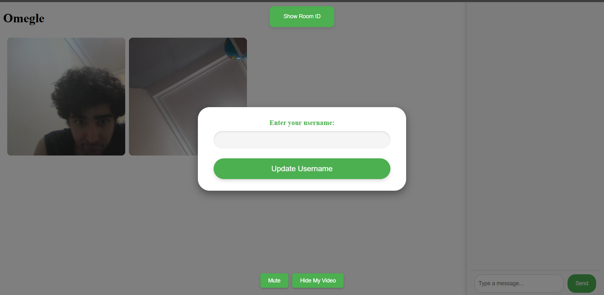
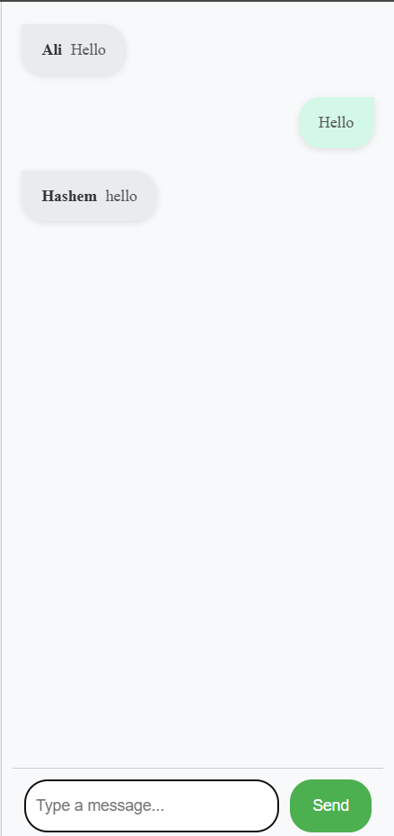

# Omegle Clone Guide

## How to Run Manually

1. **Download mkcert.exe**  
   - We will include it on the VC website.

2. **Install mkcert**  
   - Open the Command Prompt (cmd) and run the following command:
     ```
     mkcert.exe --install
     ```

3. **Generate Certificates**  
   - Navigate to the `certs` folder and run:
     ```
     mkcert.exe localhost <your IP address>
     ```

4. **Install Node.js Dependencies**  
   - Run:
     ```
     node install
     ```

5. **Access the Application**  
   - Open your browser and go to:
     ```
     https://localhost:3000
     ```

6. **Environment Variables**  
   - The `.env` file will be provided on the VC website.

### How to Find Your IP Address
- Run the following command in cmd:
  ```
  ipconfig
  ```
- Look for **Wireless LAN adapter Wi-Fi: IPv4 Address**.

---

## How to Run via Docker

1. **Open Docker Desktop**  
   - Alternatively, use any similar software to run Docker.

2. **Build the Docker Containers**  
   - Run:
     ```
     docker-compose build
     ```

3. **Start the Application**  
   - Run:
     ```
     docker-compose up -d
     ```

4. **Test the Application**  
   - Open your browser and visit:
     ```
     https://localhost:3000
     ```

---

## Docker Management Commands

- **Stop the Application**  
  ```
  docker-compose down
  ```

- **Restart the Application**  
  ```
  docker-compose down && docker-compose up
  ```

- **Check Logs**  
  ```
  docker logs -f omegle-container
  ```

- **Verify if Running**  
  ```
  docker ps
  ```

---

## Features

### First Impression
- The initial interface:
  

### Random Connection
- While searching for a partner:
  

### Choosing Username
- Username entry screen:
  

### Chatting
- **Laptop View:**
  
- **Mobile View:**
  

### Hide Camera Feature
- Option to hide the camera:
  

### Left Alone in a Meeting
- When others leave the meeting:
  

### Copying Meeting ID
- Capability to copy the Meeting ID:
  

### Entering Meeting ID
- Joining a meeting via Meeting ID:
  

### 3 People in a Meeting
- **Windows View:**
  
- **Mobile View:**
  

### 3 People Chatting
- Group chat feature:
  